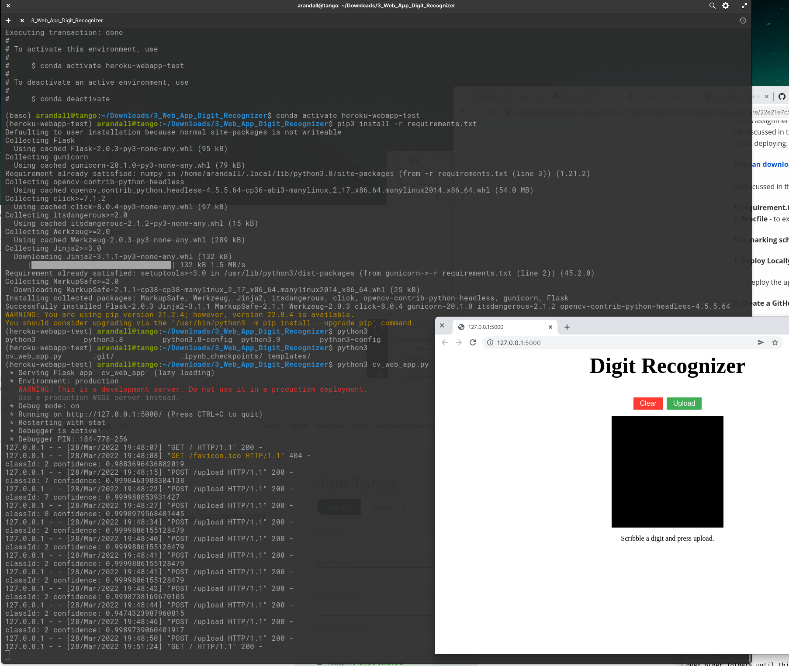

# OpenCV flask app with OpenCV

An example web app to test running OpenCV in Heroku.

## Local Install

```shell
conda create --name heroku-webapp-test
conda activate heroku-webapp-test
pip3 install -r requirements.txt 
```

Example running locally.

